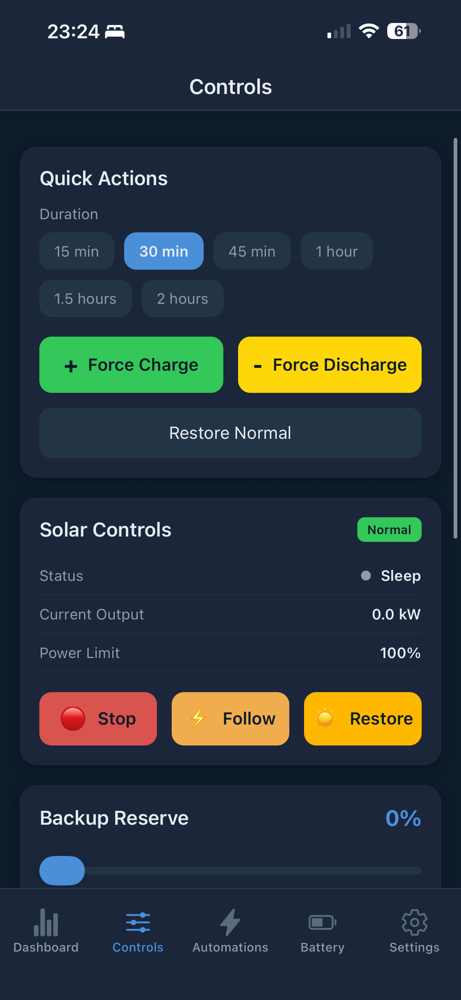
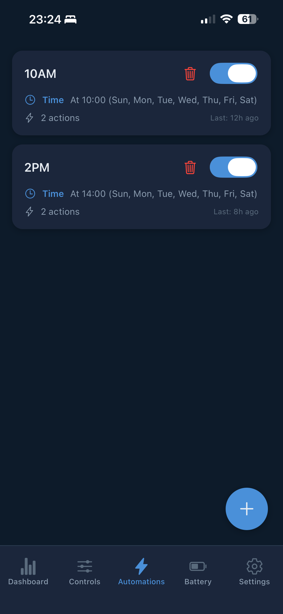

<div align="center">
  

  # PowerSync

  Intelligent battery energy management for Home Assistant. Automatically optimize your battery system with dynamic electricity pricing to minimize costs and maximize savings.

  <a href="https://paypal.me/benboller" target="_blank"></a>

  [](https://discord.gg/eaWDWxEWE3)
  [](https://github.com/custom-components/hacs)

  <a href="https://testflight.apple.com/join/FhnUtSFy"></a>
  <a href="https://play.google.com/apps/testing/com.powersync.mobile"></a>

</div>

> **Disclaimer:** This is an unofficial integration and is not affiliated with or endorsed by Tesla, Sigenergy, Sungrow, FoxESS, Amber Electric, or Octopus Energy. Use at your own risk.

---

## Supported Systems

### Battery Systems

| System | Connection | Control |
|--------|-----------|---------|
| **Tesla Powerwall** | Fleet API or Teslemetry | TOU tariff sync, force charge/discharge, export rules |
| **FoxESS** (H1, H3, H3-Pro, H3 Smart, KH + OEM rebrands) | Modbus TCP or RS485 | Work mode, force charge/discharge, backup reserve |
| **Sigenergy** | Cloud API + Modbus TCP | Tariff sync, DC solar curtailment |
| **Sungrow SH-series** | Modbus TCP | Force charge/discharge, rate limiting, export control |

### Electricity Providers

| Provider | Country | Pricing |
|----------|---------|---------|
| **Amber Electric** | Australia | Dynamic 30-min (API token required) |
| **Flow Power / AEMO** | Australia | Wholesale pricing |
| **Globird / AEMO VPP** | Australia | Static + spike detection |
| **Octopus Energy** | UK | Dynamic 30-min (Agile, Go, Flux, Tracker) |

---

## Quick Start

1. **Install** via [HACS](#installation) (custom repository)
2. **Add Integration** — Settings > Devices & Services > Add Integration > "PowerSync"
3. **Pick your electricity provider** and enter API credentials if required
4. **Connect your battery system** and enter connection details
5. **Done!** Sensors appear automatically. Enable [Smart Optimization](#smart-optimization) for automated scheduling, or install the [Mobile App](#mobile-app) for remote control.

---

## Installation

### Prerequisites

- Home Assistant with [HACS](https://hacs.xyz/) installed
- A supported battery system with network access
- Electricity provider API credentials (Amber requires a token; others are automatic)

### Steps

1. Open HACS > three dots > Custom repositories
2. Add `https://github.com/bolagnaise/PowerSync` (Category: Integration)
3. Download PowerSync and restart Home Assistant
4. Settings > Devices & Services > Add Integration > "PowerSync"
5. Follow the guided setup for your provider and battery system

---

## Battery System Setup

### Tesla Powerwall

Two connection options — choose one:

- **Teslemetry (Recommended)** — Simple API key from [teslemetry.com](https://teslemetry.com). ~$4/month.
- **Tesla Fleet API (Free)** — Install the official Tesla Fleet integration in HA first. PowerSync auto-detects it.

### FoxESS

Supports **H1, H3, H3-Pro, H3 Smart, and KH** model families via Modbus TCP or RS485 serial. No cloud API required for battery control.

OEM rebrands using identical hardware are also supported — the model family is auto-detected via register probing:

| Model Family | Also sold as |
|-------------|-------------|
| **H1** | AIO-H1, a-TroniX AX |
| **H3** | AIO-H3, Kuara H3, Sonnenkraft SK-HWR, 1KOMMA5 |
| **H3-Pro** | — |
| **H3 Smart** | — |
| **KH** | — |

- **H3 Smart:** Has built-in WiFi Modbus TCP — connect directly to the inverter's IP (appears as "espressif" on your network). Ensure inverter firmware is up to date.
- **All models:** Default port 502, slave ID 247. Model family is auto-detected during setup — no manual selection needed for rebrands.
- **Cloud API key** is optional — sync Amber/Octopus prices as time-based schedules on the inverter. Get your key from [foxesscloud.com](https://www.foxesscloud.com) > User Profile > API Management.

### Sigenergy

Requires both Cloud API (for tariff sync) and Modbus TCP (for real-time data + DC curtailment).

- Modbus TCP Server must be enabled on your inverter (configured by installer)
- See the [wiki](https://github.com/bolagnaise/PowerSync/wiki) for credential setup details

### Sungrow SH-series

Direct Modbus TCP — no cloud API required. Supports SH-series hybrid inverters.

- Default port 502, slave ID 1
- Also supports AC-coupled SG-series for solar curtailment only

---

## Smart Optimization

> **Alpha Feature:** Smart Optimization is currently in alpha. Bugs and unexpected behaviour will occur. Only enable this feature if you are willing to provide feedback and experience issues. Please report any problems in our Discord server.

PowerSync includes a **built-in LP optimizer** (scipy HiGHS) that calculates the optimal battery schedule over a 48-hour horizon using electricity prices, solar forecasts, and load patterns.

**Actions:** CHARGE (cheap grid periods) | EXPORT (expensive periods) | IDLE (hold SOC) | SELF_CONSUMPTION (natural operation)

### Enable

1. Settings > Devices & Services > PowerSync > Configure
2. Select **Smart Optimization (Built-in LP)** as optimization provider
3. Set your backup reserve percentage
4. Toggle **Enable** in the mobile app Controls screen

The optimizer runs every 5 minutes, re-optimizing as prices and forecasts update. Falls back to a greedy algorithm if scipy is unavailable.

---

## EV Smart Charging

Coordinates EV charging alongside battery optimization with dynamic power sharing. The EV charging plan is fed into the battery optimizer's load forecast so both systems work together.

**Modes:** Prefer Solar | Solar Only | Cheapest | Meet Deadline

**Supported chargers:** Tesla Wall Connector (BLE), OCPP, Wallbox, Easee, Generic (switch + number entity)

> EV charger support is experimental. See the [wiki](https://github.com/bolagnaise/PowerSync/wiki) for detailed setup.

---

## Advanced Features

| Feature | Description |
|---------|-------------|
| **AEMO Spike Detection** | Auto-discharge during price spikes for VPP participation (Tesla & Sungrow) |
| **Solar Curtailment** | Prevents paying to export during negative prices (Tesla export rules, Sigenergy/FoxESS Modbus) |
| **AC Inverter Curtailment** | Control AC-coupled inverters (Sungrow, Fronius, GoodWe, Huawei, Enphase, Zeversolar, FoxESS) |
| **Spike Protection** | Prevents grid charging during Amber price spikes |
| **Export Price Boost** | Adjusts export prices to trigger battery discharge at lower thresholds |
| **Chip Mode** | Suppress overnight exports unless price exceeds threshold |

See the [wiki](https://github.com/bolagnaise/PowerSync/wiki) for configuration details.

---

## Mobile App

Remote monitoring and control via iOS and Android.

**iOS:** [Join TestFlight](https://testflight.apple.com/join/FhnUtSFy) | **Android:** [Join Beta](https://play.google.com/apps/testing/com.powersync.mobile) (join [testers group](https://groups.google.com/g/powersync-testers) first)

### Setup

1. Get your Home Assistant URL (local or Nabu Casa)
2. Create a **Long-Lived Access Token** in your HA profile
3. Enter URL + token in the app

### Features

- **Dashboard** — Live pricing, power flow, energy summary
- **Controls** — Force charge/discharge, solar curtailment, backup reserve, smart optimization
- **Automations** — Scheduled automations and EV charging
- **Solar** — Generation history with forecast overlay
- **Settings** — Battery, EV, provider, and health configuration

<p align="center">
  
  
  
</p>

---

## Troubleshooting

| Issue | Solution |
|-------|----------|
| No sensors appearing | Check integration is enabled in Settings > Devices & Services |
| Cannot connect (FoxESS) | Verify IP (H3 Smart = "espressif" on network), firmware is current, port 502 open |
| Cannot connect (Sungrow) | Check IP, port 502, slave ID. Ensure Modbus is enabled on inverter |
| Cannot connect (Sigenergy) | Modbus TCP Server must be enabled by installer |
| TOU sync failing | Check logs: `custom_components.power_sync` |
| Missing forecast data | Ensure Solcast is configured for solar forecasts |
| Mobile app won't connect | Verify HA URL is reachable from phone, regenerate access token |

### Debug Logging

```yaml
logger:
  logs:
    custom_components.power_sync: debug
```

---

## Services

| Service | Description |
|---------|-------------|
| `power_sync.sync_tou_schedule` | Sync TOU tariff to battery |
| `power_sync.sync_now` | Refresh all data |
| `power_sync.force_charge` | Force charge (`duration_minutes`) |
| `power_sync.force_discharge` | Force discharge (`duration_minutes`) |
| `power_sync.restore_normal` | Restore normal operation |
| `power_sync.set_backup_reserve` | Set backup reserve (`backup_reserve` 0-100) |
| `power_sync.curtail_inverter` | Curtail AC inverter to zero export |
| `power_sync.restore_inverter` | Restore AC inverter |

See the [wiki](https://github.com/bolagnaise/PowerSync/wiki) for the full services reference including Tesla, Sungrow, and FoxESS-specific services.

---

## Support

- **Discord:** https://discord.gg/eaWDWxEWE3 — bug reports, feature requests, and support
- **Wiki:** https://github.com/bolagnaise/PowerSync/wiki

## License

MIT License
