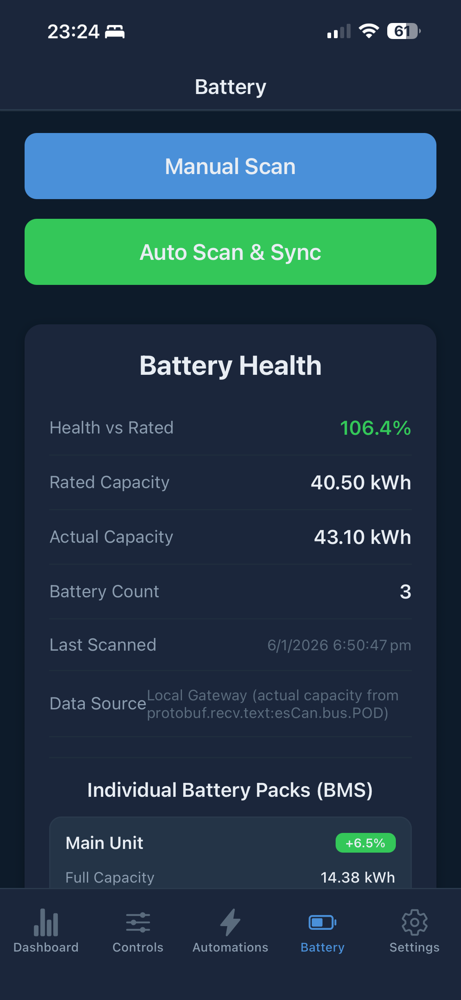
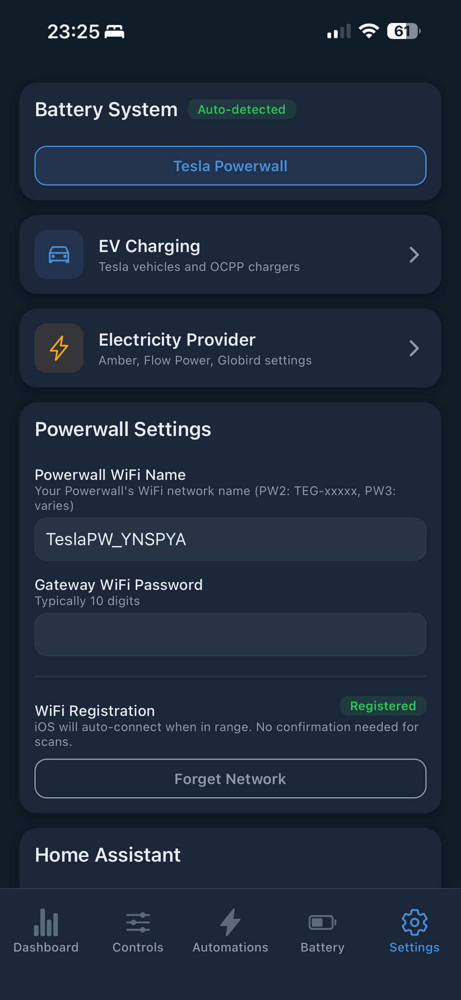

<div align="center">
  

  # PowerSync

  A Home Assistant integration for intelligent battery energy management in **Australia** and the **UK**. Supports **Tesla Powerwall** and **Sigenergy** battery systems. Automatically sync with dynamic electricity pricing from **Amber Electric**, **Flow Power** (AU), or **Octopus Energy** (UK), and capitalize on wholesale price spikes to maximize your battery's earning potential.

  <a href="https://paypal.me/benboller" target="_blank"></a>

  [](https://discord.gg/eaWDWxEWE3)
  [](https://github.com/custom-components/hacs)

  ### Mobile App (Beta)

  <a href="https://testflight.apple.com/join/FhnUtSFy"></a>
  <a href="https://play.google.com/apps/testing/com.powersync.mobile"></a>

  Monitor your battery, view live pricing, control EV charging, and create powerful automations from your phone.

  **iOS Beta:** [Join via TestFlight](https://testflight.apple.com/join/FhnUtSFy)

  **Android Beta:** [Join the testers group](https://groups.google.com/g/powersync-testers) first, then [opt-in to the beta](https://play.google.com/apps/testing/com.powersync.mobile)

  📱 [Mobile App Setup Guide](#mobile-app-setup)

</div>

## Disclaimer

This is an unofficial integration and is not affiliated with or endorsed by Tesla, Inc., Sigenergy, Amber Electric, or Octopus Energy. Use at your own risk. The developers are not responsible for any damages or issues that may arise from the use of this software.

## Features

### Supported Battery Systems

| Feature | Tesla Powerwall | Sigenergy |
|---------|:---------------:|:---------:|
| Automatic TOU Tariff Sync | ✅ | ✅ |
| Spike Protection | ✅ | ✅ |
| Export Price Boost | ✅ | ✅ |
| Chip Mode | ✅ | ✅ |
| DC Solar Curtailment | ✅ Export rules | ✅ Modbus TCP |
| AC-Coupled Inverter Curtailment | ✅ | ✅ |
| AEMO Spike Detection | ✅ | ➖ Native via Globird |
| Force Mode Toggle | ✅ | ➖ N/A |
| **Automations** | ✅ | ✅ |
| **EV Charging Controls** | ✅ Tesla Fleet | ➖ N/A |

**Connection Methods:**
- **Tesla Powerwall** - Fleet API or Teslemetry proxy
- **Sigenergy** - Sigenergy Cloud API for tariff sync + Modbus TCP for real-time energy data

### Supported Electricity Providers

| Provider | Country | Pricing Type | API Auth Required |
|----------|---------|--------------|-------------------|
| **Amber Electric** | 🇦🇺 Australia | Dynamic 30-min | ✅ API Token |
| **Flow Power** | 🇦🇺 Australia | AEMO Wholesale | ❌ No (uses AEMO API) |
| **Globird / AEMO VPP** | 🇦🇺 Australia | Static + Spike Detection | ❌ No |
| **Octopus Energy** | 🇬🇧 UK | Dynamic 30-min | ❌ No (public API) |

### Core Functionality
- **Automatic TOU Tariff Sync** - Updates your battery system with dynamic pricing every 5 minutes (Amber/Octopus) or 30 minutes (Flow Power/AEMO)
- **Real-time Pricing** - Monitor current and historical electricity prices with live updates
- **Near Real-Time Energy Monitoring** - Energy usage updates every 30 seconds
- **Timezone Support** - Auto-detects timezone for accurate time display (Australia and UK)

### Advanced Features
- **AEMO Spike Detection** - Monitors wholesale prices and switches to spike tariff during extreme price events
- **Solar Curtailment** - Prevents solar export during negative pricing periods
- **Spike Protection** - Prevents battery from charging from grid during Amber price spikes
- **Export Price Boost** - Artificially increase export prices to trigger battery exports at lower price points
- **Chip Mode** - Suppress battery exports during configured hours unless price exceeds a threshold
- **Flow Power + AEMO Support** - Full support for wholesale retailers using direct AEMO NEM pricing
- **Demand Charge Tracking** - Monitor peak demand for capacity-based electricity plans

---

## Installation

### Prerequisites

- Home Assistant installed and running
- HACS (Home Assistant Community Store) installed
- **For Amber users (AU):** Amber Electric API token ([get one here](https://app.amber.com.au/developers))
- **For Flow Power users (AU):** Uses AEMO wholesale pricing (or Amber API if you have one)
- **For Globird/AEMO VPP users (AU):** No API token required (uses AEMO spike detection)
- **For Octopus Energy users (UK):** No API token required (uses public Octopus API)
- Tesla or Sigenergy battery system with API access (see [Tesla API Options](#tesla-api-options) below)

### Installation Steps

1. **Install via HACS**
   - Open HACS in Home Assistant
   - Click the three dots in the top right
   - Select "Custom repositories"
   - Add repository URL: `https://github.com/bolagnaise/PowerSync`
   - Category: `Integration`
   - Click "Add"
   - Click "Download" on the PowerSync integration
   - Restart Home Assistant

2. **Add Integration**
   - Go to Settings → Devices & Services
   - Click "+ Add Integration"
   - Search for "PowerSync"
   - Click to add

3. **Configure**
   - Select your **electricity provider**:
     - **Australia:** Amber, Flow Power, Globird, AEMO VPP
     - **UK:** Octopus Energy
   - Enter API tokens if required (Amber needs token; Octopus doesn't)
   - Select your **battery system** (Tesla Powerwall or Sigenergy)
   - Enter battery API credentials (Teslemetry key, Tesla Fleet, or Sigenergy Cloud)
   - Configure additional options as needed

4. **Verify Setup**
   - Check that new sensors appear:
     - `sensor.current_electricity_price`
     - `sensor.solar_power`
     - `sensor.grid_power`
     - `sensor.battery_power`
     - `sensor.home_load`
     - `sensor.battery_level`
   - Check that the switch appears:
     - `switch.auto_sync_tou_schedule`

---

## Tesla API Options

PowerSync supports two methods for accessing your Tesla Powerwall. **Choose one** - you don't need both.

### Option 1: Teslemetry (Recommended - ~$4/month)

The easiest setup option. Teslemetry is a third-party proxy service for Tesla API.

| Pros | |
|------|---|
| ✅ Simple API key authentication | No OAuth complexity |
| ✅ Works with localhost | No public domain needed |
| ✅ 2-minute setup | Just copy/paste API key |
| ✅ Reliable service | Well-maintained proxy |

**Setup:**
1. Sign up at https://teslemetry.com
2. Connect your Tesla account
3. Copy your API key
4. Paste into PowerSync settings

### Option 2: Tesla Fleet API (Free)

Direct OAuth access to Tesla's Fleet API. Completely free but requires more setup.

| Pros | Cons |
|------|------|
| ✅ Completely free | ⚠️ Requires Tesla Fleet integration in HA |
| ✅ Direct API access | ⚠️ More setup steps |
| ✅ Automatic token refresh | |

**Setup:**
1. Install the official **Tesla Fleet** integration in Home Assistant
   - Settings → Devices & Services → Add Integration → "Tesla Fleet"
   - Follow the OAuth login flow
2. PowerSync automatically detects your Tesla Fleet credentials
3. Leave the Teslemetry field empty during PowerSync setup

---

## Mobile App Setup

The PowerSync mobile app connects to your Home Assistant instance to provide remote monitoring and control of your battery system.

### Requirements

- PowerSync integration installed and configured in Home Assistant
- Home Assistant accessible via URL (local or remote)
- A Long-Lived Access Token from Home Assistant

### Setup Steps

1. **Get your Home Assistant URL**
   - **Local:** `http://homeassistant.local:8123` or `http://<your-ip>:8123`
   - **Remote:** Your Nabu Casa URL (`https://xxxxx.ui.nabu.casa`) or custom domain

2. **Create a Long-Lived Access Token**
   - Open Home Assistant web interface
   - Click your profile (bottom left)
   - Scroll down to **Long-Lived Access Tokens**
   - Click **Create Token**
   - Give it a name (e.g., "PowerSync Mobile")
   - Copy the token immediately (it won't be shown again)

3. **Connect the App**
   - Open the PowerSync mobile app
   - Enter your Home Assistant URL
   - Paste your Long-Lived Access Token
   - Tap **Connect**

### Troubleshooting

- **Connection failed:** Ensure your Home Assistant URL is correct and accessible from your phone
- **Connection timeout:** Check that your phone can reach your HA instance (same network for local URLs)
- **Invalid token:** Generate a new Long-Lived Access Token and try again

### App Screenshots

<p align="center">
  
  
  
</p>
<p align="center">
  
  
  
</p>

**Features:**
- **Dashboard** - Live pricing, power flow, and energy summary
- **Controls** - Force charge/discharge, solar curtailment, backup reserve
- **Automations** - Create and manage scheduled automations
- **Solar** - Daily/monthly/yearly generation with forecast overlay
- **Battery** - Health monitoring and BMS data (Tesla Powerwall)
- **Settings** - Configure battery system, EV charging, and electricity provider

---

## Key Features Explained

### AEMO Spike Detection (Tesla only)

This option is primarily intended for Tesla Powerwall users with VPPs that offer AEMO Spike exports (Globird, AGL, Engie) but don't natively support Tesla batteries. Sigenergy users on Globird don't need this feature as Globird natively supports Sigenergy for spike exports.

When prices exceed your configured threshold (e.g., $300/MWh), the system:
- Saves your current tariff configuration
- Saves your current Powerwall operation mode
- Switches to autonomous (TOU) mode
- Uploads a spike tariff with very high sell rates to encourage battery export
- Restores your original operation mode when spike ends
- Restores your normal tariff when prices return to normal

**Monitoring Frequency:** Checks AEMO prices every 1 minute.

### Solar Curtailment

Prevents paying to export solar during negative pricing periods (≤0c/kWh).

| Battery System | Method | Behavior |
|----------------|--------|----------|
| **Tesla** | Export rules API | Sets export to "never", restores to "battery_ok" when positive |
| **Sigenergy** | Modbus TCP | Sets export limit to 0kW (load-following mode) |

**Sigenergy Load-Following Mode:**
- ✅ Solar continues powering the house
- ✅ Battery still charges from solar
- ✅ Only grid export is blocked during negative prices

### Spike Protection (Amber Only)

Prevents your battery from charging from the grid during Amber price spikes. When wholesale prices spike, your battery may see an arbitrage opportunity and charge from grid - this feature stops that behavior.

**How It Works:**
When Amber reports `spikeStatus: 'potential'` or `'spike'` for a period, buy prices are overridden to ensure charging from grid is always unprofitable during spikes.

### Export Price Boost

Artificially increases export prices sent to your battery system to trigger exports at lower price points. Useful when Amber export prices are in the 20-25c range where the battery's algorithm may not trigger exports.

**Configuration Options:**
| Setting | Description | Default |
|---------|-------------|---------|
| Enable Export Price Boost | Toggle the feature on/off | Off |
| Price Offset (c/kWh) | Fixed amount added to all export prices | 0 |
| Minimum Price (c/kWh) | Floor for export prices | 0 |
| Activation Threshold (c/kWh) | Boost only applies if actual price is at or above this value | 0 |
| Boost Start Time | When to start applying boost | 17:00 |
| Boost End Time | When to stop applying boost | 21:00 |

### Chip Mode

Suppress battery exports during configured hours (typically overnight) unless the price exceeds a threshold.

**Configuration Options:**
| Setting | Description | Default |
|---------|-------------|---------|
| Enable Chip Mode | Toggle the feature on/off | Off |
| Start Time | When to start suppressing exports | 22:00 |
| End Time | When to stop suppressing exports | 06:00 |
| Price Threshold (c/kWh) | Allow exports only above this price | 30 |

---

## Sigenergy Battery System Support

Full support for Sigenergy DC-coupled battery systems as an alternative to Tesla Powerwall.

**Features:**
- **Tariff Sync via Cloud API** - Uploads Amber pricing to Sigenergy Cloud using the same 30-minute TOU format
- **Real-Time Energy Data via Modbus** - Reads solar, battery, grid power and SOC from your inverter
- **DC Solar Curtailment** - Controls DC solar via Modbus TCP during negative prices (load-following mode)

**Connection Requirements:**
| Connection | Purpose | Required |
|------------|---------|----------|
| **Cloud API** | Tariff sync to Sigenergy | ✅ Yes |
| **Modbus TCP** | Real-time energy data + DC curtailment | ✅ Yes |

> ⚠️ **Important:** Modbus TCP Server must be enabled on your Sigenergy inverter before PowerSync can connect. This setting is typically configured by your installer via the SigenStor app or installer portal. If you're getting "Connection refused" errors, contact your installer to enable "Modbus TCP Server" on the inverter.
>
> **Device ID Note:** If you have an AC Charger installed, it uses Device ID 1 by default. The inverter must be set to a higher ID (e.g., 2). Confirm your Device ID configuration with your installer.

### Getting Sigenergy Cloud API Credentials

**What You Need:**
| Credential | Description | Where to Find |
|------------|-------------|---------------|
| **Email** | Your Sigenergy account email | Your login email |
| **Password** | Your Sigenergy account password | Just use your normal password! |
| **Device ID** | 13-digit numeric identifier | Browser dev tools (see below) |
| **Station ID** | Your Sigenergy station identifier | SigenAI or browser dev tools |

**Getting Device ID:**

1. **Open the Sigenergy Web Portal**
   - Go to https://app-aus.sigencloud.com/ in your browser
   - Don't log in yet!

2. **Open Browser Developer Tools**
   - Press `F12` or right-click → "Inspect"
   - Go to the **Network** tab
   - Check "Preserve log" checkbox

3. **Log In Normally**
   - Enter your email and password
   - Click Login

4. **Find the Auth Request**
   - In the Network tab, look for a request to `oauth/token`
   - Click on it to see the details
   - Go to the **Payload** tab
   - **userDeviceId**: This 13-digit number is your `Device ID`

**Getting Station ID:**
- **Easiest**: Ask SigenAI in the app: "Tell me my StationID"
- **Alternative**: In dev tools, look for requests containing `stationId` in the response

### Sigenergy Configuration

1. Install PowerSync via HACS
2. Add the integration: Settings → Devices & Services → Add Integration → PowerSync
3. Select **Sigenergy** as your battery system
4. Enter your Sigenergy Cloud credentials
5. Select your Sigenergy station from the list
6. Enter your Sigenergy inverter's **Modbus IP address**
7. Optionally enable DC solar curtailment

---

## Octopus Energy UK Support

Full support for UK users with **Octopus Energy** dynamic tariffs.

**Supported Products:**
| Product | Description |
|---------|-------------|
| **Agile Octopus** | Dynamic half-hourly pricing based on wholesale rates |
| **Octopus Go** | EV tariff with cheap overnight rates (00:30-05:30) |
| **Octopus Flux** | Solar/battery optimized import/export tariff |
| **Octopus Tracker** | Daily wholesale price tracking |

**Features:**
- **No API token required** - Uses Octopus public pricing API
- **Half-hourly pricing** - Same 30-minute resolution as Amber Electric
- **Automatic TOU sync** - Uploads pricing to Tesla/Sigenergy
- **Regional pricing** - Select your GSP (Grid Supply Point) region
- **Negative prices** - Handles negative wholesale prices (you get paid to use electricity)
- **Export rates** - Supports Agile Outgoing and Flux export tariffs

**Configuration:**
1. Select **Octopus Energy (UK)** as your electricity provider
2. Choose your **product** (Agile, Go, Flux, Tracker)
3. Select your **GSP region** (A-P) - find this on your Octopus bill
4. Configure your battery system (Tesla or Sigenergy)

**GSP Regions:**
| Code | Region |
|------|--------|
| A | Eastern England |
| B | East Midlands |
| C | London |
| D | Merseyside and North Wales |
| E | Midlands |
| F | North Eastern |
| G | North Western |
| H | Southern |
| J | South Eastern |
| K | South Wales |
| L | South Western |
| M | Yorkshire |
| N | South Scotland |
| P | North Scotland |

---

## AC-Coupled Inverter Curtailment

Control AC-coupled solar inverters directly during negative pricing periods. This feature works with **any battery system** (Tesla, Sigenergy, or others).

**Supported Inverter Brands:**
| Brand | Connection | Models |
|-------|------------|--------|
| **Sungrow** | Modbus TCP | SG series (string), SH series (hybrid) |
| **Fronius** | Modbus TCP | Primo, Symo, Gen24/Tauro, Eco |
| **GoodWe** | Modbus TCP | ET, EH, BT, BH, ES, EM series (hybrid) |
| **Huawei** | Modbus TCP | SUN2000 L1, M1, M2 series |
| **Enphase** | HTTPS API | IQ Gateway, Envoy-S (microinverters) |
| **Zeversolar** | HTTP API | TLC series, Zeversolair Mini/TL |

---

## Available Services

### Core Services

| Service | Description | Parameters |
|---------|-------------|------------|
| `power_sync.sync_tou_schedule` | Manually sync TOU tariff to battery | None |
| `power_sync.sync_now` | Refresh data from provider and battery | None |

### Battery Control

| Service | Description | Parameters |
|---------|-------------|------------|
| `power_sync.force_charge` | Force charge from grid | `duration_minutes` (required) |
| `power_sync.force_discharge` | Force discharge to grid | `duration_minutes` (required) |
| `power_sync.restore_normal` | Restore normal battery operation | None |

### Powerwall Settings (Tesla only)

| Service | Description | Parameters |
|---------|-------------|------------|
| `power_sync.set_backup_reserve` | Set backup reserve percentage | `backup_reserve` (0-100) |
| `power_sync.set_operation_mode` | Set operation mode | `mode` (autonomous, self_consumption, backup) |
| `power_sync.set_grid_export` | Set grid export behaviour | `export` (everything, pv_only, never) |
| `power_sync.set_grid_charging` | Enable/disable grid charging | `enabled` (true/false) |

### AC Inverter Curtailment

| Service | Description | Parameters |
|---------|-------------|------------|
| `power_sync.curtail_inverter` | Manually curtail AC inverter to zero export | None |
| `power_sync.restore_inverter` | Restore AC inverter to normal operation | None |

### Data Services

| Service | Description | Parameters |
|---------|-------------|------------|
| `power_sync.get_calendar_history` | Get energy history (for mobile app) | `start_date`, `end_date` |
| `power_sync.sync_battery_health` | Scan battery health from gateway | None |

---

## Pre-built Dashboard (Optional)

A pre-built Lovelace dashboard is included for visualizing all PowerSync data.

**Required HACS Frontend Cards:**
- `mushroom` - Compact chips for controls
- `card-mod` - Custom card styling
- `power-flow-card-plus` - Real-time energy flow visualization
- `apexcharts-card` - Advanced charting for price/energy history

**Installation:**
1. Install the required HACS cards (HACS → Frontend → search for each card)
2. Copy the dashboard YAML from `HA Dashboard/power_sync_dashboard.yaml`
3. In Home Assistant: Settings → Dashboards → Add Dashboard
4. Edit the new dashboard → 3 dots menu → "Raw configuration editor"
5. Paste the YAML content and save

**Required Helper Entities:**

The Force Charge and Force Discharge controls require `input_select` helpers:

1. Go to **Settings → Devices & Services → Helpers**
2. Click **+ Create Helper → Dropdown**
3. Create `force_charge_duration` with options: `15`, `30`, `45`, `60`, `90`, `120`
4. Create `force_discharge_duration` with options: `15`, `30`, `45`, `60`, `90`, `120`

---

## Troubleshooting

- **No sensors appearing**: Check that the integration is enabled in Settings → Devices & Services
- **Invalid API token**: Verify tokens at Amber and Teslemetry/Tesla Fleet
- **No Tesla sites found**:
  - If using Tesla Fleet: Ensure the Tesla Fleet integration is loaded and working
  - If using Teslemetry: Ensure your Tesla account is linked in Teslemetry
- **TOU sync failing**: Check Home Assistant logs for detailed error messages
- **Octopus prices not loading**:
  - Verify your GSP region code (A-P) is correct - check your Octopus bill
  - Ensure the product code matches your actual tariff (Agile, Go, Flux, Tracker)
  - Octopus publishes next-day prices after 4pm UK time - prices may be limited before then

**Enable Debug Logging:**
```yaml
logger:
  logs:
    custom_components.power_sync: debug
```

---

## Support

- GitHub Issues: https://github.com/bolagnaise/PowerSync/issues
- Discord: https://discord.gg/eaWDWxEWE3

## License

MIT License
