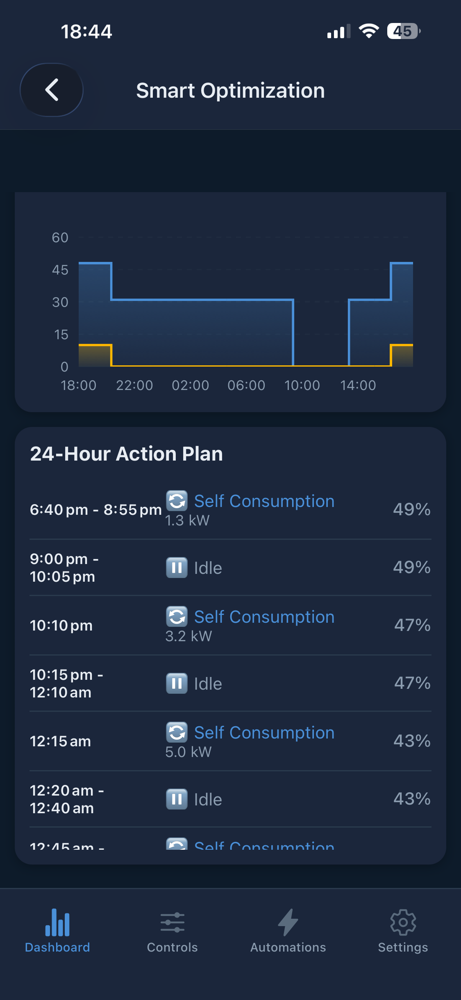
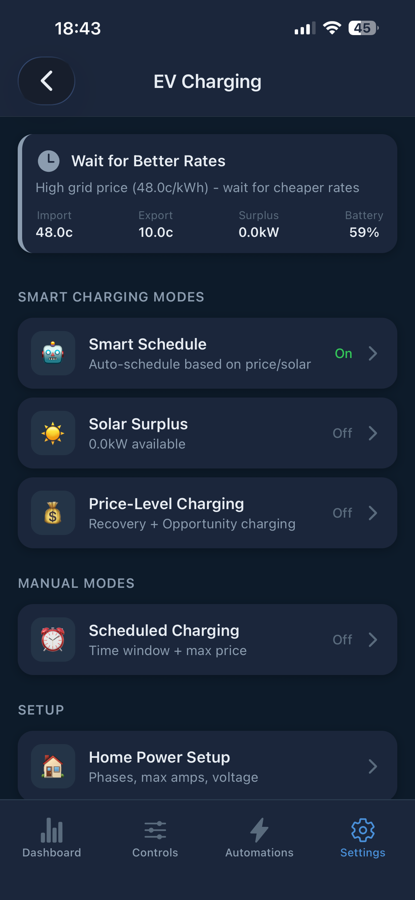
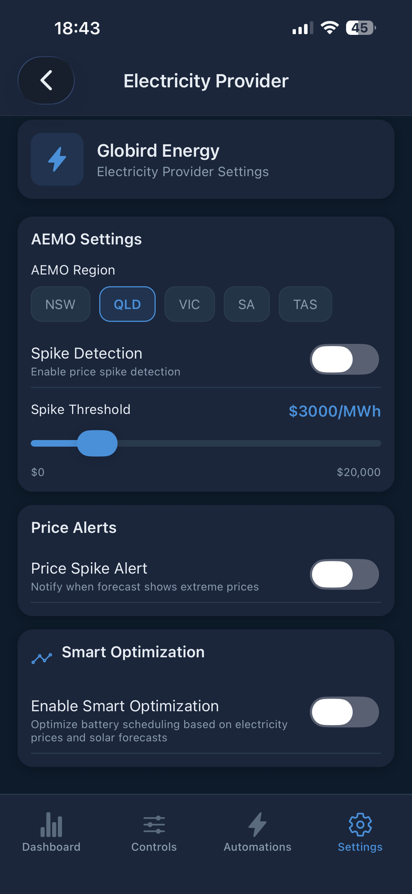
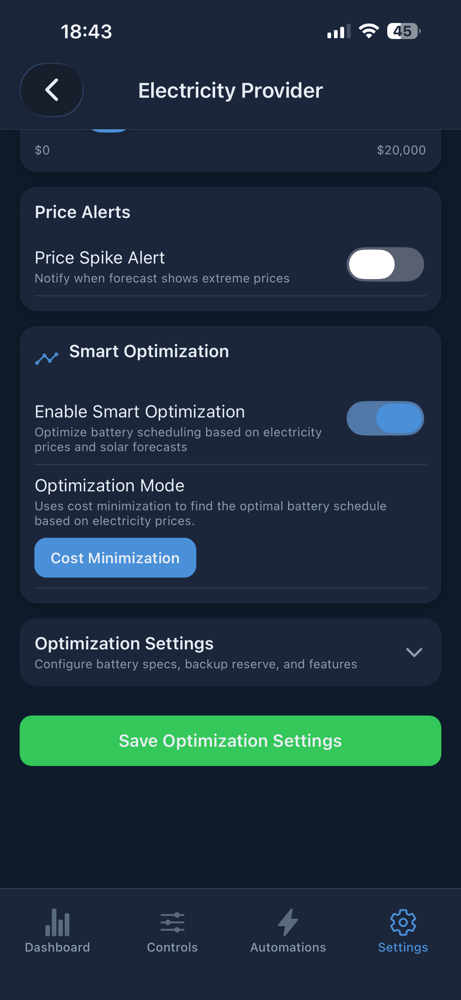

  

  # PowerSync

  Intelligent battery energy management for Home Assistant. Automatically optimize your battery system with dynamic electricity pricing to minimize costs and maximize savings.

  
  
  

  
  

> **Disclaimer:** This is an unofficial integration and is not affiliated with or endorsed by Tesla, Sigenergy, Sungrow, FoxESS, GoodWe, Amber Electric, or Octopus Energy. Use at your own risk.

---

## Supported Systems

### Battery Systems

| System | Connection | Control |
|--------|-----------|---------|
| **Tesla Powerwall** | Fleet API or Teslemetry | TOU tariff sync, force charge/discharge, export rules |
| **FoxESS** (H1, H3, H3-Pro, H3 Smart, KH + OEM rebrands) | Modbus TCP or RS485 | Work mode, force charge/discharge, backup reserve |
| **Sigenergy** | Cloud API + Modbus TCP | Tariff sync, DC solar curtailment |
| **GoodWe** (ET, EH, BT, BH, ES, EM, BP) | UDP or TCP (local) | Force charge/discharge, backup reserve, export limit |
| **Sungrow SH-series** | Modbus TCP | Force charge/discharge, rate limiting, export control, dual inverter |

### Electricity Providers

| Provider | Country | Pricing |
|----------|---------|---------|
| **Amber Electric** | Australia | Dynamic 30-min (API token required) |
| **Flow Power / AEMO** | Australia | Wholesale pricing |
| **Globird / AEMO VPP** | Australia | Static + spike detection |
| **Octopus Energy** | UK | Dynamic 30-min (Agile, Go, Flux, Tracker) |
| **NZ TOU** | New Zealand | Static TOU (Octopus NZ, Electric Kiwi, Contact Energy, Custom) |

---

## Quick Start

1. **Install** via [HACS](#installation) (custom repository)
2. **Add Integration** — Settings > Devices & Services > Add Integration > "PowerSync"
3. **Pick your electricity provider** and enter API credentials if required
4. **Connect your battery system** and enter connection details
5. **Done!** Sensors appear automatically and a **PowerSync dashboard** is auto-created in your sidebar. Enable [Smart Optimization](https://github.com/bolagnaise/PowerSync/wiki/Smart-Optimization) for automated scheduling, or install the [Mobile App](#mobile-app) for remote control.

---

## Installation

### Prerequisites

- Home Assistant with [HACS](https://hacs.xyz/) installed
- A supported battery system with network access
- Electricity provider API credentials (Amber requires a token; others are automatic)

### Steps

Or manually:

1. Open HACS > three dots > Custom repositories
2. Add `https://github.com/bolagnaise/PowerSync` (Category: Integration)
3. Download PowerSync and restart Home Assistant
4. Settings > Devices & Services > Add Integration > "PowerSync"
5. Follow the guided setup for your provider and battery system

---

## Features

| Feature | Description | Wiki |
|---------|-------------|------|
| **Battery System Setup** | Tesla, FoxESS, Sigenergy, GoodWe, Sungrow connection guides | [Setup Guide](https://github.com/bolagnaise/PowerSync/wiki/Battery-System-Setup) |
| **Smart Optimization** | Built-in LP optimizer calculates optimal charge/discharge schedule using prices, solar, and load | [Details](https://github.com/bolagnaise/PowerSync/wiki/Smart-Optimization) |
| **EV Smart Charging** | Coordinate EV charging with battery optimization — Solar, Cheapest, Deadline modes | [Details](https://github.com/bolagnaise/PowerSync/wiki/EV-Smart-Charging) |
| **Advanced Features** | AEMO spike detection, solar curtailment, spike protection, export boost, chip mode | [Details](https://github.com/bolagnaise/PowerSync/wiki/Advanced-Features) |
| **Sensors** | Core power sensors, daily energy tracking, FoxESS Modbus sensors, optimizer status | [Full List](https://github.com/bolagnaise/PowerSync/wiki/Sensors) |
| **Services** | Force charge/discharge, TOU sync, backup reserve, inverter curtailment | [Reference](https://github.com/bolagnaise/PowerSync/wiki/Services-Reference) |
| **Troubleshooting** | Connection issues, debug logging, common fixes | [Guide](https://github.com/bolagnaise/PowerSync/wiki/Troubleshooting) |

---

## Mobile App

Remote monitoring and control via iOS and Android.

**iOS:** [Join TestFlight](https://testflight.apple.com/join/FhnUtSFy) | **Android:** [Join Beta](https://play.google.com/apps/testing/com.powersync.mobile) (join [testers group](https://groups.google.com/g/powersync-testers) first)

### Setup

1. Get your Home Assistant URL (local or Nabu Casa)
2. Create a **Long-Lived Access Token** in your HA profile
3. Enter URL + token in the app

### Features

- **Dashboard** — Live pricing, power flow, energy summary
- **Smart Optimization** — 24-hour battery schedule, action plan, cost tracking
- **EV Charging** — Smart scheduling, solar surplus, price-level charging
- **Settings** — Battery, EV, provider, and optimization configuration

  
  
  

  
  
  

  
  
  

---

## Sponsors

<!-- sponsors --><!-- sponsors -->

## Support

- **Discord:** https://discord.gg/eaWDWxEWE3 — bug reports, feature requests, and support
- **Wiki:** https://github.com/bolagnaise/PowerSync/wiki

## License

[PolyForm Noncommercial 1.0.0](LICENSE) — free for personal and noncommercial use. Commercial use requires separate permission from the author.
