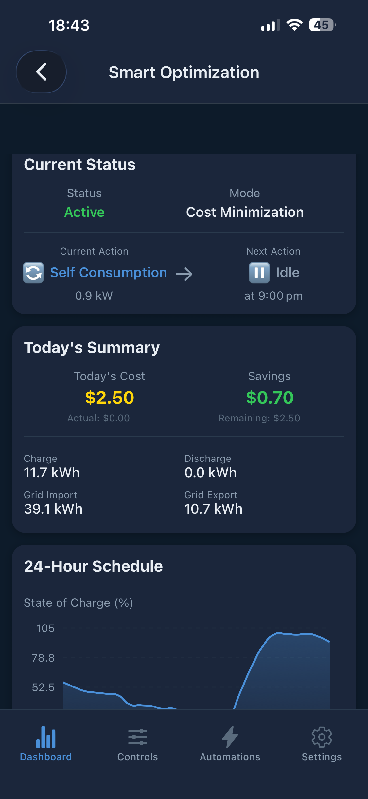
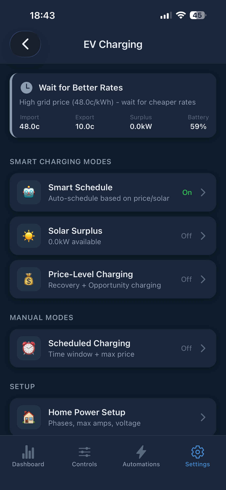
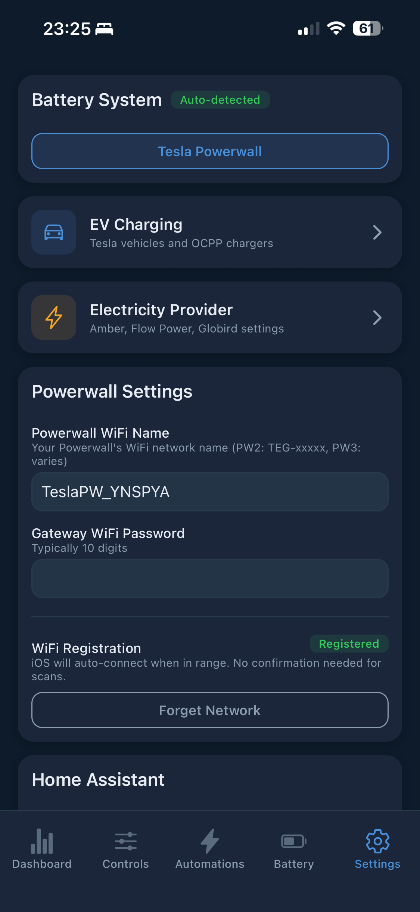

  

  # PowerSync

  Intelligent battery energy management for Home Assistant. Automatically optimize your battery system with dynamic electricity pricing to minimize costs and maximize savings.

  
  
  

  
  

> **Disclaimer:** This is an unofficial integration and is not affiliated with or endorsed by Tesla, Sigenergy, Sungrow, FoxESS, GoodWe, AlphaESS, ESY Sunhome, Solax, SAJ, Neovolt, Bytewatt, Amber Electric, Localvolts, Flow Power, GloBird, Octopus Energy, EPEX/ENTSO-E, or AEMO. Use at your own risk.

> [!WARNING]
> **The built-in optimizer is actively under development.** You should expect occasional bugs and schedules that don't behave as expected — particularly on unusual tariffs, battery configurations, or edge cases. If you see something odd, please report it on [Discord](https://discord.gg/eaWDWxEWE3) or open a [GitHub issue](https://github.com/bolagnaise/PowerSync/issues) with your tariff details and the action plan it generated.

---

## Supported Systems

### Battery Systems

| System | Connection | Control |
|--------|-----------|---------|
| **Tesla Powerwall** | PowerSync.cc, Fleet API, or Teslemetry | TOU tariff sync, force charge/discharge, export rules, **off-grid/reconnect** |
| **FoxESS** (H1, H3, H3-Pro, H3 Smart, KH + OEM rebrands) | Modbus TCP or RS485 | Work mode, force charge/discharge, backup reserve |
| **Sigenergy** | Cloud API + Modbus TCP | Remote EMS control, force charge/discharge, DC solar curtailment. Smart Optimization requires Remote EMS with Sigenergy AI/native optimisation disabled; see [Sigenergy notes](docs/wiki/Sigenergy.md) |
| **Solax Hybrid** (X1/X3, Gen4/Gen5/Gen6, AC Retro-Fit) | Via [Solax Modbus](https://github.com/wills106/homeassistant-solax-modbus) integration (HACS) | LP optimizer, force charge/discharge, backup reserve, export control |
| **GoodWe** (ET, EH, BT, BH, ES, EM, BP) | UDP direct control, TCP local, or TCP/502 with HA GoodWe entity mode for LAN/Kit-20 | Force charge/discharge, backup reserve, export limit. LAN/Kit-20 force modes require entity mode; see [GoodWe notes](docs/wiki/GoodWe.md) |
| **Sungrow SH-series** | Modbus TCP | Force charge/discharge, rate limiting, export control, dual inverter |
| **AlphaESS** (SMILE5, SMILE-Hi5/Hi10, SMILE-B3, SMILE-T10, SMILE-G3, Storion-T30) | Modbus TCP + optional Cloud API | Force charge/discharge, dispatch SOC targeting, DC solar curtailment |
| **ESY Sunhome** (HM series) | Via [ESY Sunhome](https://github.com/branko-lazarevic/esysunhome) companion integration (HACS) | LP optimizer, AEMO spike export, Saving Sessions (mode-only control) |
| **SAJ H2 / HS2** | Via [SAJ H2 Modbus](https://github.com/stanus74/home-assistant-saj-h2-modbus) companion integration (HACS) | LP optimizer, force charge/discharge, AEMO spike export (no backup reserve write) |
| **Neovolt / Bytewatt** | Via [Neovolt Modbus](https://github.com/pvandenh/NeovoltBattery_ModbusPlugin) companion integration (HACS) | LP optimizer, force charge/discharge, backup reserve |

### AC-Coupled Inverter Curtailment

Solar inverters that bypass the battery can be curtailed during negative feed-in prices:

| Inverter | Connection | Method |
|----------|-----------|--------|
| **Fronius** | SunSpec Modbus | WMaxLimPct power limiting |
| **Sungrow SG** | Modbus TCP | Percentage power limit |
| **Sungrow SH** | Modbus TCP | Export limit register |
| **Enphase** | IQ Gateway REST API | DPEL/DER export limit |
| **FoxESS** | Modbus TCP | Remote active power |
| **Huawei** | Smart Dongle Modbus | Feed grid power limit |
| **GoodWe** | Modbus TCP | Export limit register |
| **Zeversolar** | HTTP API | Power limit percentage |
| **Solax** | Modbus TCP or HA entity | Export control user limit (reg 0x42) |
| **Sigenergy** | Modbus TCP | Grid export limit / DC curtailment |
| **AlphaESS** | Modbus TCP | MAX feed-into-grid percent (register 0x0800) |

### Electricity Providers

| Provider | Country | Pricing |
|----------|---------|---------|
| **Amber Electric** | Australia | Dynamic 5-min & 30-min (API token required) |
| **Localvolts** | Australia | Real-time 5-min wholesale pricing (API key + Partner ID) |
| **Flow Power / AEMO** | Australia | Wholesale pricing |
| **Globird / AEMO VPP** | Australia | Retail tariff schedule + AEMO spike detection |
| **Octopus Energy** | UK | Dynamic 30-min (Agile, Go, Intelligent Go, Flux, Tracker). Reads from [BottlecapDave's integration](https://github.com/BottlecapDave/HomeAssistant-OctopusEnergy) when installed |
| **EPEX Day-Ahead** | EU (DE, AT, BE, NL, DK, SE) | Hourly day-ahead pricing with configurable surcharge & tax |
| **NZ TOU** | New Zealand | Static TOU (Octopus NZ, Electric Kiwi, Contact Energy, Custom) |

---

## Quick Start

1. **Install** via [HACS](#installation) (custom repository)
2. **Add Integration** — Settings > Devices & Services > Add Integration > "PowerSync"
3. **Pick your electricity provider** and enter API credentials if required
4. **Connect your battery system** and enter connection details
5. **Done!** Sensors appear automatically and a **PowerSync dashboard** is auto-created in your sidebar. Enable [Smart Optimization](https://github.com/bolagnaise/PowerSync/wiki/Smart-Optimization) for automated scheduling, or install the [Mobile App](#mobile-app) for remote control.

> **Tesla Powerwall users — two options:**
> - **Home Assistant integration (this repo):** Free. Connects via the built-in OAuth flow at [powersync.cc](https://powersync.cc) — no developer registration, no monthly fees. Just click "Sign in with Tesla" during setup.
> - **[PowerSync Cloud](https://powersync.cc/#cloud) ($4.99/month):** No Home Assistant required. Fully hosted service — sign in with Tesla, choose your retailer (Amber, GloBird, Energy Locals), and PowerSync handles negative-price protection, AEMO spike export, and real-time monitoring entirely in the cloud. Includes iOS/Android apps.

---

## Installation

### Prerequisites

- Home Assistant with [HACS](https://hacs.xyz/) installed
- A supported battery system with network access
- Electricity provider credentials where required: Amber API token, Localvolts API key + Partner ID, and optional credentials for Flow Power portal or Octopus Saving Sessions

### Steps

Or manually:

1. Open HACS > three dots > Custom repositories
2. Add `https://github.com/bolagnaise/PowerSync` (Category: Integration)
3. Download PowerSync and restart Home Assistant
4. Settings > Devices & Services > Add Integration > "PowerSync"
5. Follow the guided setup for your provider and battery system

---

## Features

| Feature | Description | Wiki |
|---------|-------------|------|
| **Battery System Setup** | Tesla, FoxESS, Sigenergy, GoodWe, Sungrow, AlphaESS, ESY Sunhome, Solax Hybrid, SAJ H2/HS2 connection guides | [Setup Guide](https://github.com/bolagnaise/PowerSync/wiki/Battery-System-Setup) |
| **Smart Optimization** | Built-in LP optimizer calculates optimal charge/discharge schedule using prices, solar, and load. **Solar forecasting (Solcast) must be configured for accurate scheduling.** | [Details](https://github.com/bolagnaise/PowerSync/wiki/Smart-Optimization) |
| **EV Smart Charging** | Coordinate EV charging with battery optimization — Solar, Cheapest, Deadline modes | [Details](https://github.com/bolagnaise/PowerSync/wiki/EV-Smart-Charging) |
| **Advanced Features** | AEMO spike detection, solar curtailment, spike protection, export boost, **off-grid control** | [Details](https://github.com/bolagnaise/PowerSync/wiki/Advanced-Features) |
| **Sensors** | Core power sensors, daily energy tracking, FoxESS Modbus sensors, optimizer status | [Full List](https://github.com/bolagnaise/PowerSync/wiki/Sensors) |
| **Services** | Force charge/discharge, hold SOC, TOU sync, backup reserve, inverter curtailment, **off-grid/reconnect** | [Reference](https://github.com/bolagnaise/PowerSync/wiki/Services-Reference) |
| **Troubleshooting** | Connection issues, debug logging, common fixes | [Guide](https://github.com/bolagnaise/PowerSync/wiki/Troubleshooting) |

---

## Mobile App

Remote monitoring and control via iOS and Android.

**iOS:** [Join TestFlight](https://testflight.apple.com/join/FhnUtSFy) | **Android:** [Google Play](https://play.google.com/store/apps/details?id=com.powersync.mobile)

### Setup

1. Get your Home Assistant URL (local or Nabu Casa)
2. Create a **Long-Lived Access Token** in your HA profile
3. Enter URL + token in the app

### Features

- **Dashboard** — Live pricing, power flow, energy summary
- **Controls** — Force charge/discharge, backup reserve, off-grid/reconnect
- **Smart Optimization** — 24-hour battery schedule, action plan, cost tracking
- **EV Charging** — Smart scheduling, solar surplus, price-level charging
- **Automations** — Time, price, and grid-status triggers with battery/EV/grid actions
- **Settings** — Battery, EV, provider, and optimization configuration
- **Demo Mode** — Try the app without a Home Assistant connection using simulated data

  
  
  

  
  
  

---

## Sponsors

<!-- sponsors --><!-- sponsors -->

## Support

- **Discord:** https://discord.gg/eaWDWxEWE3 — bug reports, feature requests, and support
- **Wiki:** https://github.com/bolagnaise/PowerSync/wiki

## License

Copyright (c) 2024–2026 Ben Boller. All rights reserved.

Licensed under [PolyForm Noncommercial 1.0.0](LICENSE) — free for personal, hobby, and noncommercial use.

**Commercial use is prohibited without prior written permission from the copyright holder.** This includes use within a commercial organisation, integration into a paid product or service, and redistribution as part of a commercial system. To enquire about a commercial licence, open an issue or contact via [GitHub](https://github.com/bolagnaise).
